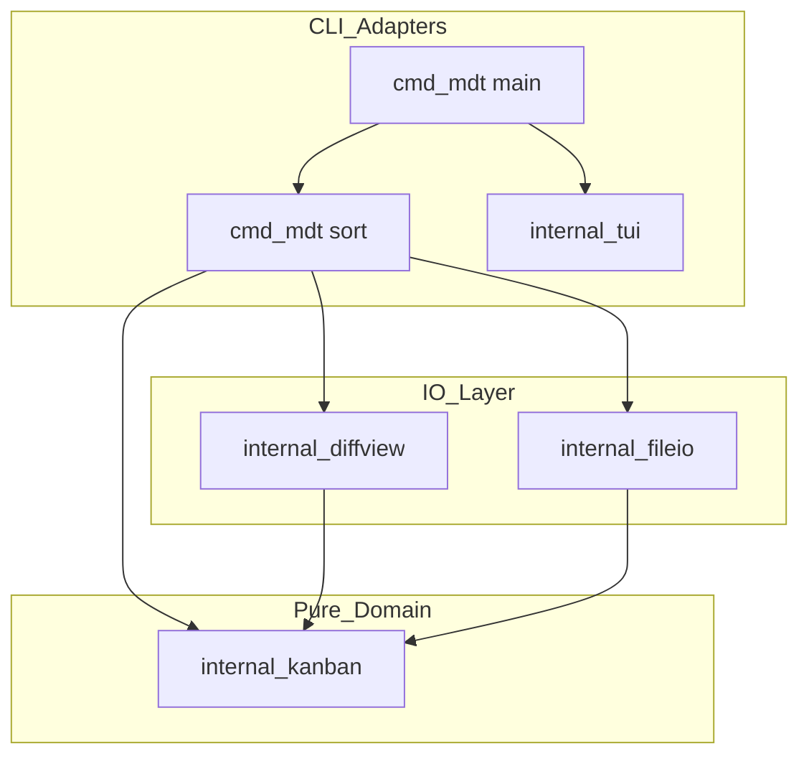
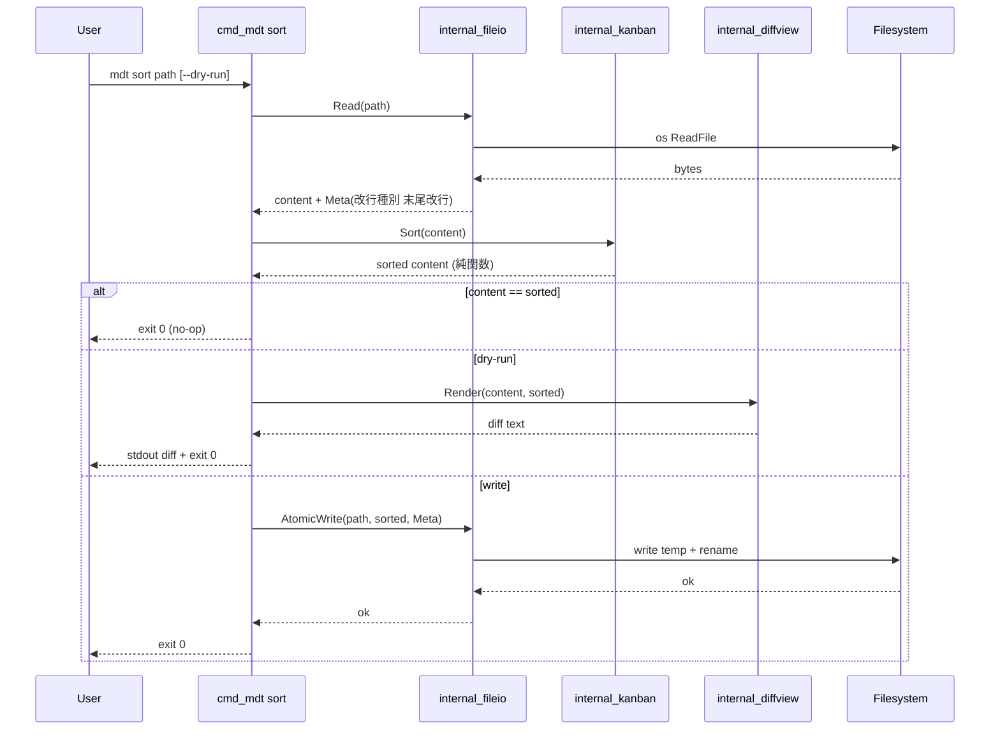
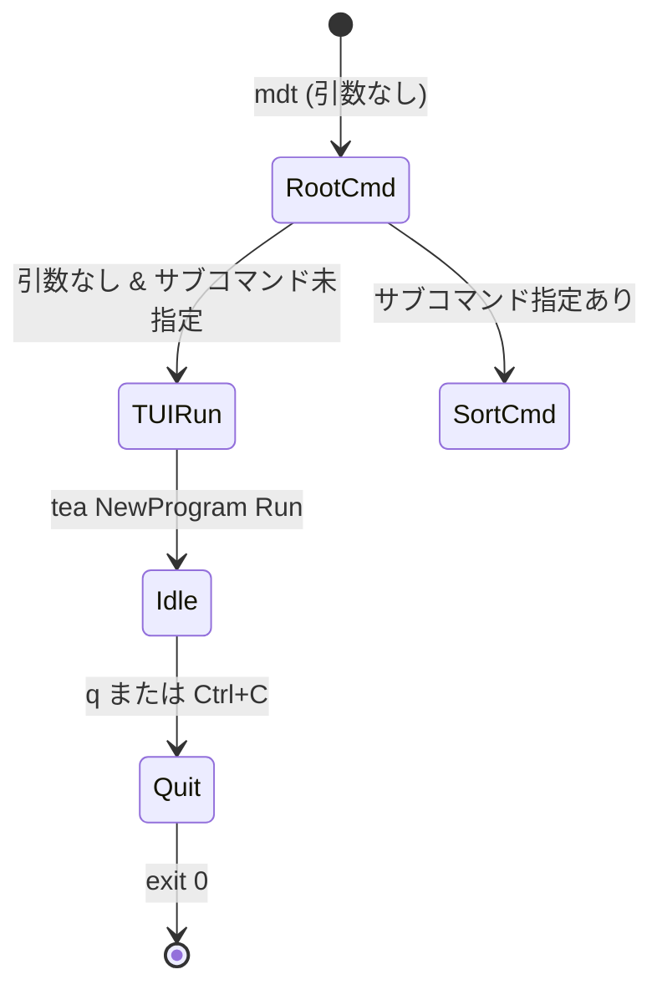

# Design Document: kanban-sort

> 言語: ja（spec.json に従う）
> 対応 spec: `.kiro/specs/kanban-sort/`
> 関連: `requirements.md`, `research.md`, `brief.md`

## Overview

**Purpose**: 本機能は、Obsidian の `_kanban/personal.md` のような「上部=完了タスク集／下部=未完了 todo」構成のマークダウンを手動運用している個人ユーザーに対し、未完了パートで `[x]` 化した todo（および親子インデント構造を持つブロック）を完了集末尾へ自動移動する CLI ツール `mdt sort` を提供する。

**Users**: 単一の Markdown ファイルでタスクを運用する個人ユーザー（本人）が、`mdt sort <file>` あるいは `mdt sort --dry-run <file>` を介して利用する。引数なし起動時は将来拡張用の Bubble Tea TUI スケルトンが立ち上がる。

**Impact**: 手動カット&ペーストによる順序ミス・親子崩壊リスクを排し、決定的な純関数ロジック (`kanban.Sort(input) → output`) によって同一入力に対し常に同一結果を保証する。git・ネットワーク・サブプロセスへの副作用は持たず、対象ファイルの読み書きのみ行う。

### Goals

- `kanban.Sort(input string) (string, error)` を「対象ファイル外への I/O を一切含まない決定的な純関数」として確立し、TDD で構築する
- 完了集／未完了パートの境界判定（最後の divider `---` を優先し、divider が無い場合は最初の `[ ]` 直前）と親子インデント尊重ルール（タブ＝半角スペース2個以上、子完了かつ親未完了で移動禁止 / 親完了かつ子に未完了残で移動禁止 / 親子全完了で塊ごと移動）を機械的に決定論で実装する
- `--dry-run` での非破壊差分プレビューと、デフォルトのアトミック上書き（中間破損禁止・改行コード保持）を提供する
- 引数なし起動時に Bubble Tea スケルトンを起動し、`q` / `Ctrl+C` で終了コード 0 を返す
- `internal/kanban` パッケージ内の純ロジックから `os` / `io` / `fmt`(stdout) / `time` / `rand` の import を禁止する静的ルールを設計レベルで明示する

### Non-Goals

- 複数ファイル一括処理、ディレクトリ再帰、ファイルブラウザ等のリッチ TUI UX
- git 連携・自動コミット・バックアップファイル生成
- front matter / 表 / コードブロック / リンク等のリッチ Markdown 要素に対する高度な保護
- 完了タスク集側の並べ替え（先入れ先出し以外）
- 設定ファイル (`.mdtrc` 等) 読み込み・グローバル設定
- 本 spec での `mdt format` / `mdt stats` 等の追加サブコマンド実装

## Boundary Commitments

### This Spec Owns

- 単一 Markdown ファイル (UTF-8 想定) の読み込み → ソート → 上書き／差分出力の end-to-end フロー
- 行ベースの軽量パーサ（インデント深さ・チェックボックス状態・残テキスト）
- 完了集／未完了境界の判定アルゴリズム（最後の divider `---` を優先し、divider が無い場合は最初の `[ ]` 直前を境界とする）
- 親子インデントツリーの構築と移動可否判定
- 純関数 `kanban.Sort(input string) (string, error)` の公開 API 安定化
- `--dry-run` 用の最小差分フォーマット（行単位 `+`/`-`/` ` プレフィックス）
- 改行コード（LF/CRLF）と末尾改行の有無を保持するアトミック上書き
- Cobra ルート + `sort` サブコマンドの CLI 構成と終了コード規約
- Bubble Tea スケルトン（起動・初期画面・終了のみ）
- ロジック層から I/O 系 import を禁止する静的ルール（linter / ast-grep 設定の所在）

### Out of Boundary

- 複数ファイル一括処理・ディレクトリ走査
- git / 外部プロセス / ネットワークアクセス
- リッチ TUI（ファイルブラウザ、編集、画面遷移）
- 設定ファイル読み込み
- 完了集の並べ替え規則の選択
- Markdown のリッチ要素（front matter, 表, コードブロック, リンク）に対する個別保護ロジック（行単位の素通し以上の処理は行わない）
- 将来サブコマンド（`mdt format`, `mdt stats` 等）の実装

### Allowed Dependencies

- **Go 1.25+** ランタイム（標準ライブラリ）
- **`github.com/spf13/cobra`**: サブコマンド・フラグ解析・終了コード規約・`--help` 自動生成。バージョンは `go get github.com/spf13/cobra@latest` の実測値を `go.mod` に固定する（v1.10 系の事前指定は行わず、tasks.md 1.4 の手順に委譲）
- **`github.com/charmbracelet/bubbletea`**: TUI スケルトンの Model/Update/View ループ。バージョンは `go get github.com/charmbracelet/bubbletea@latest` の実測値を `go.mod` に固定（API 互換性は v1 系前提だが、固定値の確定は tasks.md 1.4 に委譲）
- **`github.com/charmbracelet/x/exp/teatest`**（テスト時のみ）: TUI のヘッドレステスト。同じく `@latest` を `go.mod` に固定
- **`just`**: タスクランナ（CI 想定でなく開発者ローカルでの統一）
- 上記以外の追加依存は本 spec 範囲では導入しない（差分生成・diff ライブラリ等は自前最小実装で完結させる）

### Revalidation Triggers

以下の変更は将来の `mdt format` 等の下流サブコマンドや本機能の利用者に再検証を要求する:

- `kanban.Sort(input string) (string, error)` のシグネチャ変更（引数追加、戻り値型変更、エラー型公開化）
- 完了集／未完了境界判定アルゴリズムの変更（境界定義の変更、複数境界対応など）
- インデント判定規則の変更（Tab と半角スペース 2 個以上の同一視を解除する等）
- ファイル I/O 層 (`internal/fileio`) の改行コード保持・アトミック書き込み API 変更
- 終了コード規約の変更（成功 0 / 使用方法不正 2 / 実行時エラー 1 の体系を変える）
- ロジック層からの import 禁止リスト（`os` / `io` / `fmt`(stdout) / `time` / `rand`）の緩和

## Architecture

### Architecture Pattern & Boundary Map

採用パターンは **Hexagonal 風の薄いレイヤード分離（Option C）**。research.md で整理した 3 案のうち、純粋性 (R7) を最少パッケージで満たし、将来の `mdt format` への再利用余地を残せるため。

#### 改行コード責務の分割（契約レベル）

改行コード保持（R4.4）は **`fileio` 層の単独責務**であり、`kanban.Sort` は LF 統一の文字列のみを扱う。データフローは以下に固定する。

```
[disk bytes (LF or CRLF or Mixed)]
   │  fileio.Read: 改行コード検出 → LF 統一に正規化 → Meta(改行種別, 末尾改行有無) を抽出
   ▼
[content: LF 統一文字列]  +  Meta
   │  kanban.Sort(content): LF 入力 → LF 出力（純関数、改行コード非関知）
   ▼
[sorted: LF 統一文字列]  +  Meta（不変）
   │  fileio.AtomicWrite(path, sorted, Meta): Meta を再適用（LF → 元の改行種別 + 末尾改行有無）
   ▼
[disk bytes (元の改行種別を保持)]
```

この責務分割により、(a) `kanban.Sort` を将来サブコマンドから直接呼ぶ際は LF 統一前提を満たす義務が呼出側にあること、(b) CRLF/末尾改行保持は `fileio` 層の責任で完結すること、を不変条件として固定する。



**Architecture Integration**:

- **Selected pattern**: 純ドメイン (`internal/kanban`) を中心に、I/O 副作用層 (`internal/fileio`) と純表現層 (`internal/diffview`) を外側に配置し、CLI/TUI アダプタ (`cmd/mdt`, `internal/tui`) から呼び出す
- **Domain/feature boundaries**: 純ドメインは「Markdown 文字列 → Markdown 文字列」の変換責務のみ。差分生成は純表現として独立させ、I/O は責務を限定する
- **Existing patterns preserved**: 既存コードは存在しない (greenfield)。CLAUDE.md の「関心の分離」「コントラクト層の厳密化」「静的検査ルールは linter / ast-grep に寄せる」を骨格に反映
- **New components rationale**: `internal/kanban`（純ロジックの単一公開 API）、`internal/diffview`（差分の純関数化）、`internal/fileio`（副作用の局所化）、`cmd/mdt`（Cobra アダプタ）、`internal/tui`（Bubble Tea スケルトン）— それぞれ責務が独立しており、合算による可読性低下より分離の明確性を優先する
- **Steering compliance**: ステアリング不在のため CLAUDE.md・brief・requirements に明記された制約のみ採用。design 確定後に `/kiro-steering` を実行し `tech.md`（Go 1.25 / Cobra / Bubble Tea / `just` / TDD）と `structure.md`（本レイアウト）を整備することを推奨する（research.md §8 に既記載）

### 依存方向と静的ルール

- **依存方向**: `cmd/mdt` → (`internal/tui`, `internal/fileio`, `internal/diffview`, `internal/kanban`) / `internal/diffview` → `internal/kanban`（型のみ） / `internal/fileio` → 標準ライブラリのみ / `internal/kanban` → 標準ライブラリのみ（ただし import 禁止リストあり）
- **`internal/kanban` の import 禁止**: `os`, `io`, `io/fs`, `os/exec`, `net/http`, `time`, `math/rand`, `crypto/rand`, `fmt` の `Print*`/`Fprint*` 系標準出力（テスト用に `fmt.Sprintf` 等の文字列整形は許可）
- **静的ルール所在**: `tools/` 配下に linter 設定（`.golangci.yml` の `depguard` ルール）と ast-grep ルール（`tools/ast-grep/no-io-in-kanban.yml` 等）を配置する。具体ルール定義はタスクフェーズで詰める

### Technology Stack

| Layer | Choice / Version | Role in Feature | Notes |
|-------|------------------|-----------------|-------|
| CLI | `github.com/spf13/cobra`（`@latest` 実測値を `go.mod` に固定） | サブコマンド `sort` 定義、`--dry-run` フラグ、`--help`、終了コード | brief で確定。バージョン解決は tasks.md 1.4 で `go get @latest` → `go.mod` 固定。Cobra のデフォルト挙動（使用方法不正でコード 2）を踏襲 |
| TUI | `github.com/charmbracelet/bubbletea`（`@latest` 実測値を `go.mod` に固定） | 引数なし起動時の Model/Update/View スケルトン | バージョン解決は tasks.md 1.4 で `go get @latest` → `go.mod` 固定。`q` / `Ctrl+C` で `tea.Quit` |
| Domain | Go 1.25 標準ライブラリのみ | `internal/kanban` の純ロジック | 副作用パッケージ import を禁止（depguard） |
| File I/O | Go 1.25 標準ライブラリ (`os`, `io`, `bufio`) | 読み込み・改行コード検出・アトミック書き込み | 同一ディレクトリに temp file → `os.Rename` |
| Diff View | Go 1.25 標準ライブラリのみ | `--dry-run` 用の最小差分フォーマット生成 | 自前 LCS or 行単位 `+`/`-`/` ` プレフィックス。外部 diff ライブラリは導入しない |
| Test | Go 標準 `testing`, `testdata/` ゴールデン, `teatest` | テーブル駆動 + ゴールデン + TUI ヘッドレス | TDD（探索→Red→Green→Refactor） |
| Tooling | `just`, `golangci-lint`, `ast-grep` | レシピ統一・静的検査 | `Justfile` を初期構築 |

> 詳細トレードオフ（Option A/B/C 比較、外部 diff ライブラリ採用是非など）は `research.md` §4・§6 を参照。

## File Structure Plan

### Directory Structure

```
.
├── go.mod                                  # Go 1.25 モジュール定義（モジュールパスは初期化時に確定）
├── go.sum
├── Justfile                                # just test / lint / build / run / fmt の最小レシピ
├── README.md                               # 利用方法（mdt sort, --dry-run, TUI 起動）
├── LICENSE                                 # 同梱依存（Cobra: Apache-2.0, Bubble Tea: MIT）方針を含む
├── .gitignore                              # 既存ファイルへ Go / バイナリ / IDE エントリを追記
├── cmd/
│   └── mdt/
│       ├── main.go                         # entrypoint: Cobra ルート構築 + Execute
│       ├── root.go                         # ルートコマンド定義 + 引数なし時の TUI 起動分岐
│       ├── sort.go                         # `sort` サブコマンド定義 + フラグ + RunE
│       └── exitcode.go                     # 終了コード定数（OK=0 / UsageError=2 / RuntimeError=1）
├── internal/
│   ├── kanban/                             # 純ドメイン: Markdown 文字列 → 文字列
│   │   ├── sort.go                         # 公開 API: Sort(input string) (string, error)
│   │   ├── parser.go                       # 行 → トークン (インデント深さ/チェック状態/テキスト)
│   │   ├── tree.go                         # 親子ブロック構築・走査
│   │   ├── boundary.go                     # 完了集／未完了パート境界判定
│   │   ├── move.go                         # 移動可否判定 + 再構築
│   │   └── doc.go                          # パッケージ doc + import 禁止方針コメント
│   ├── diffview/                           # 純表現: 差分文字列生成
│   │   └── diff.go                         # Render(before, after string) string
│   ├── fileio/                             # 副作用層: 読み込み・改行コード保持・アトミック書き込み
│   │   ├── read.go                         # Read(path) → (content, Meta, error)
│   │   ├── write.go                        # AtomicWrite(path, content, Meta) error
│   │   └── meta.go                         # Meta 型（改行種別 / 末尾改行有無）
│   └── tui/
│       └── skeleton.go                     # Bubble Tea Model/Update/View 最小実装 + Run()
├── tools/
│   ├── ast-grep/                           # ast-grep ルール（kanban からの I/O import 禁止 等）
│   │   └── no-io-in-kanban.yml
│   └── golangci/
│       └── .golangci.yml                   # depguard で internal/kanban の import 制限
└── testdata/
    ├── kanban/                             # kanban 層（LF 統一前提）のゴールデン
    │   ├── basic_unchanged.md.in
    │   ├── basic_unchanged.md.out
    │   ├── single_x_move.md.in
    │   ├── single_x_move.md.out
    │   ├── parent_child_all_done.md.in
    │   ├── parent_child_all_done.md.out
    │   ├── parent_done_child_open.md.in    # 親完了/子未完 → 移動禁止
    │   ├── parent_done_child_open.md.out
    │   ├── child_done_parent_open.md.in    # 子完了/親未完 → 移動禁止
    │   └── child_done_parent_open.md.out
    └── fileio/                             # fileio 層（改行コード保持）のフィクスチャ
        ├── crlf_preserve.md.in             # CRLF 保持
        └── crlf_preserve.md.out
```

### Modified Files

- `.gitignore` — Go バイナリ (`mdt`)、`coverage.out`、IDE 設定 (`.vscode/`, `.idea/`) 等を追記

> 各ファイルは単一責務。`internal/kanban` 内のファイル分割は将来 `internal/markdown`（純パーサ）への再分離を見据えた論理単位だが、本 spec では同一パッケージ内に閉じる（research.md §4 推奨方針）。

## System Flows

### `mdt sort <file>` 主要フロー



**Key Decisions**:

- 純ドメイン (`Kanban`) には `os` / `io` を渡さず、**LF 統一の文字列のみ**流す（R7-3, R7-4）
- 改行コード保持は `fileio` 層の単独責務。`Read` で LF 正規化 + `Meta` 抽出 → `Sort` は LF→LF → `AtomicWrite` で `Meta` 再適用、の三段構成で R4-4 を満たす
- 入力 == 出力の場合は書き込みも diff 出力も行わず即座に exit 0（R1-3, R2-2, R2-3）
- `--dry-run` と通常書き込みは Cobra の `RunE` 内分岐で完全に分離（R4-1, R4-3, R4-6）
- `--dry-run` 出力は `diffview.Render` の **LCS ベース unified-diff 風フォーマット**で固定（R4-2）

### `mdt`（引数なし）起動フロー



## Requirements Traceability

| Requirement | Summary | Components | Interfaces | Flows |
|-------------|---------|------------|------------|-------|
| 1.1 | `[x]` ブロックを完了集末尾へ移動 | `internal/kanban` | `Sort(input) (string, error)` | sort 主要フロー |
| 1.2 | 出現順序を保ったまま完了集末尾へ追記 | `internal/kanban` (`move.go`) | `Sort` 内部不変条件 | sort 主要フロー |
| 1.3 | 移動対象なしならファイル不変 | `cmd/mdt sort` | content == sorted 比較分岐 | sort 主要フロー (no-op 分岐) |
| 1.4 | 対象ファイル外への副作用禁止 | `internal/kanban`, `internal/fileio` | depguard / ast-grep 静的ルール | — |
| 1.5 | 読み取り失敗時のエラーと非ゼロ終了 | `cmd/mdt sort`, `internal/fileio` | `Read(path) error` + RuntimeError(1) | sort 主要フロー |
| 2.1 | divider があれば最後の divider、なければ最初の `[ ]` 直前を境界とする | `internal/kanban` (`boundary.go`) | 内部関数 `findBoundary(lines) int` | — |
| 2.2 | divider と `[ ]` が一切なければ不変・正常終了 | `internal/kanban`, `cmd/mdt sort` | `Sort` 早期リターン | sort 主要フロー (no-op) |
| 2.3 | divider がなく先頭が `[ ]` なら完了集空で不変 | `internal/kanban` (`boundary.go`) | 内部関数 `findBoundary` | sort 主要フロー (no-op) |
| 2.4 | 完了集側の非チェックボックス行を改変しない | `internal/kanban` (`move.go`) | `Sort` の不変条件 | — |
| 2.5 | 未完了パート側の非チェックボックス行を移動対象としない | `internal/kanban` (`move.go`) | `Sort` の不変条件 | — |
| 3.1 | タブ／半角2個以上をインデント差として判定 | `internal/kanban` (`parser.go`) | 内部関数 `indentDepth(line) int` | — |
| 3.2 | 親より深いインデント連続を子孫として扱う | `internal/kanban` (`tree.go`) | 内部関数 `buildBlocks(lines) []Block` | — |
| 3.3 | 親 `[x]` の子孫に `[ ]` が残れば移動しない | `internal/kanban` (`move.go`) | `canMove(block) bool` | — |
| 3.4 | 子 `[x]` の祖先が `[ ]` なら単独移動しない | `internal/kanban` (`move.go`) | `canMove(block) bool` | — |
| 3.5 | 親子全 `[x]` ならブロック単位で移動 | `internal/kanban` (`move.go`) | `Sort` の構築結果 | sort 主要フロー |
| 3.6 | 移動対象ブロックの順序・インデント文字・幅を保持 | `internal/kanban` (`move.go`) | `Sort` の不変条件（行をそのまま転送） | — |
| 4.1 | `--dry-run` で書き込み無し・差分を stdout 出力 | `cmd/mdt sort`, `internal/diffview` | `Render(before, after) string` | sort 主要フロー (dry-run 分岐) |
| 4.2 | 差分が一目で識別可能なフォーマット | `internal/diffview` | 行単位 `+`/`-`/` ` プレフィックス | — |
| 4.3 | 通常実行時は対象ファイルを上書き、バックアップなし | `cmd/mdt sort`, `internal/fileio` | `AtomicWrite(path, content, Meta)` | sort 主要フロー (write 分岐) |
| 4.4 | 改行コード（LF/CRLF）と末尾改行の有無を保持 | `internal/fileio`（単独責務）| `Read` で LF 正規化 + `Meta` 抽出 / `AtomicWrite` で `Meta` 再適用。`kanban.Sort` は LF 統一前提で改行コード非関知 | sort 主要フロー（fileio 三段構成） |
| 4.5 | 書き込み失敗時に中間状態を残さず非ゼロ終了 | `internal/fileio`, `cmd/mdt sort` | temp file + `os.Rename` のアトミック書き込み | — |
| 4.6 | `--dry-run` で内容変更を一切行わない | `cmd/mdt sort` | dry-run 分岐内で `AtomicWrite` を呼ばない | sort 主要フロー (dry-run 分岐) |
| 5.1 | `sort` サブコマンドと位置引数 | `cmd/mdt sort` | Cobra `cobra.ExactArgs(1)` | — |
| 5.2 | `--help` / `-h` で利用方法表示・コード 0 | `cmd/mdt` | Cobra 標準挙動 | — |
| 5.3 | 終了コード規約（成功 0 / 使用方法不正 非ゼロ / 実行時エラー 非ゼロ） | `cmd/mdt exitcode.go` | `OK=0 / UsageError=2 / RuntimeError=1` | — |
| 5.4 | ファイルパス省略時にヒント付きエラー・非ゼロ終了 | `cmd/mdt sort` | Cobra の `Args` バリデーション + UsageError | — |
| 6.1 | 引数なし起動で TUI 起動 | `cmd/mdt root.go`, `internal/tui` | `tui.Run() error` | mdt 引数なし起動フロー |
| 6.2 | `q` / `Ctrl+C` で明示終了 | `internal/tui` | Bubble Tea Update での `tea.Quit` | — |
| 6.3 | 初期スコープは起動・初期画面・終了のみ | `internal/tui` | View は固定文字列のみ | — |
| 6.4 | TUI 終了で exit 0 | `cmd/mdt root.go` | `tui.Run` 戻り値 nil → exit 0 | — |
| 7.1 | ロジックを純関数として呼び出し可能に提供 | `internal/kanban` | `Sort(input string) (string, error)` | — |
| 7.2 | 同一入力に対し同一出力（決定的） | `internal/kanban` | `time` / `rand` import 禁止 + ゴールデンテスト | — |
| 7.3 | ロジック内部から外部 I/O を発生させない | `internal/kanban` | depguard / ast-grep 静的ルール | — |
| 7.4 | I/O と純ロジックの分離 | レイアウト全体 | `internal/kanban` ⊥ `internal/fileio` ⊥ `internal/tui` | アーキテクチャ図 |

## Components and Interfaces

| Component | Domain/Layer | Intent | Req Coverage | Key Dependencies (P0/P1) | Contracts |
|-----------|--------------|--------|--------------|--------------------------|-----------|
| `internal/kanban` | Pure Domain | Markdown 文字列を入力に、ソート済み Markdown 文字列を返す純関数 | 1.1, 1.2, 1.3, 1.4, 2.1–2.5, 3.1–3.6, 7.1–7.4 | Go 標準ライブラリ (P0 / 一部 import 禁止) | Service |
| `internal/diffview` | Pure View | 2 つの文字列から行単位差分テキストを生成する純関数 | 4.1, 4.2 | `internal/kanban` 出力（型なし、文字列） (P1) | Service |
| `internal/fileio` | Side Effects | 改行コードを保持してファイルを読み、アトミックに上書きする | 1.4, 1.5, 4.3, 4.4, 4.5 | Go `os`, `io`, `bufio` (P0) | Service |
| `cmd/mdt` (root + sort) | CLI Adapter | Cobra でルート定義・`sort` サブコマンド・終了コード規約・TUI 起動分岐 | 1.5, 4.1, 4.3, 4.6, 5.1–5.4, 6.1, 6.4 | `cobra` (P0), `kanban` (P0), `fileio` (P0), `diffview` (P0), `tui` (P0) | Service |
| `internal/tui` | TUI Adapter | Bubble Tea スケルトン（起動・初期画面・終了のみ） | 6.1, 6.2, 6.3, 6.4 | `bubbletea` (P0) | Service |

### Pure Domain

#### `internal/kanban`

| Field | Detail |
|-------|--------|
| Intent | Markdown 文字列に対する決定的なソート純関数を提供する |
| Requirements | 1.1, 1.2, 1.3, 1.4, 2.1, 2.2, 2.3, 2.4, 2.5, 3.1, 3.2, 3.3, 3.4, 3.5, 3.6, 7.1, 7.2, 7.3, 7.4 |

**Responsibilities & Constraints**

- 入力 Markdown を行配列に分解し、トークン化（インデント深さ・チェック状態・テキスト）する
- 完了集／未完了パート境界（最後の divider `---` 優先、なければ最初の `[ ]` 直前）を判定する
- 親子ブロックを構築し、移動可否を機械的に判定する
- 移動可能なブロックを未完了パートから取り除き、完了集末尾へ「未完了パート内の出現順」で追加し、結果文字列を再構築して返す
- パッケージ内では以下の import を禁止する: `os`, `io`, `io/fs`, `os/exec`, `net/http`, `time`, `math/rand`, `crypto/rand`, および `fmt` の `Print*`/`Fprint*` 系（`fmt.Sprintf` 等は許可）

**Dependencies**

- Inbound: `cmd/mdt sort` — sort サブコマンドが本パッケージを呼び出す (P0)
- Inbound: `internal/diffview` — 差分対象を本パッケージの出力で生成 (P1, ただし型結合はなく文字列のみ)
- Outbound: Go 標準ライブラリ (`strings`, `unicode/utf8` 等) のみ
- External: なし

**Contracts**: Service [x]

##### Service Interface

```go
// Sort は入力 Markdown 文字列を受け取り、未完了パート内の移動可能な
// [x] ブロックを完了集末尾へ移動した結果を返す。決定的かつ副作用なし。
//
// 入力 == 出力の場合（移動対象なし、未完了パートなし、完了集空 等）も
// エラーではなく等価の文字列を返す（呼び出し側で no-op 判定する）。
//
// error は入力構造の致命的不整合（UTF-8 不正等）にのみ用いる。
// インデント混在・空ファイル・末尾改行有無などは正常入力として扱う。
func Sort(input string) (string, error)
```

- **Preconditions**: `input` は Go の `string` として有効（UTF-8 想定）。サイズ上限はメモリに依存する。
- **Preconditions（追補）**: `input` の改行コードは **LF (`\n`) 統一**であること。CRLF や混在は呼出側（`fileio.Read`）で正規化済みである必要がある。`Sort` は改行コード変換を行わない。
- **Postconditions**:
  - 出力の改行コードは **LF 統一**（入力と同一）。CRLF/末尾改行の復元は呼出側 `fileio.AtomicWrite` の責務であり、本関数は関知しない
  - 完了集側の非チェックボックス行は位置・内容ともに不変
  - 未完了パート側の非チェックボックス行は位置・内容ともに不変
  - 移動可能なブロックは「未完了パート内の出現順」で完了集末尾へ追加される
  - 移動対象ブロックの内部行順序・インデント文字種・インデント幅は保存される
- **Invariants**:
  - 入力の行集合と出力の行集合は完全一致（順序のみ変動）
  - `Sort(Sort(x)) == Sort(x)` （冪等性）
  - 同一入力は常に同一出力（決定性）
  - 改行コード非変換: 入力に CRLF が混入しても、`Sort` はそれを LF へ正規化しない（呼出側責務違反として扱う）

##### 内部補助関数（パッケージ非公開）

| 関数 | シグネチャ | 役割 |
|------|------------|------|
| `parseLines` | `func parseLines(input string) []line` | 行を `line{indent int, kind kind, raw string}` に分解（行は LF で分割、`raw` は改行を含まない） |
| `indentDepth` | `func indentDepth(raw string) int` | タブ 1 個または半角 2 個以上を 1 段として深さ算出（後述の正規化規則に従う） |
| `findBoundary` | `func findBoundary(lines []line) int` | 最後の divider 行のインデックスを返す。divider が無ければ最初の `[ ]` 行のインデックスを返す。どちらも無ければ `len(lines)` |
| `buildBlocks` | `func buildBlocks(lines []line, from int) []block` | `from` 以降の **未完了パート全行**を対象に、最浅インデント行を**ルート**とする順序付きフォレストを構築する。ルートは `[x]` / `[ ]` / `kindOther` / `kindDivider` のいずれも含み、配下に深いインデント行を子孫として吸収する |
| `canMove` | `func canMove(b block) bool` | ルート自身が `kindChecked` (`[x]`) かつ子孫の全 `[x]`/`[ ]` 行が `kindChecked` であるときに `true`。ルートが `kindUnchecked` (`[ ]`) / `kindDivider` / `kindOther`、または子孫に `kindUnchecked` が 1 つでもあれば `false`（R3.3, R3.4 を一括で吸収） |
| `assemble` | `func assemble(prefix []line, completed []block, remaining []line) string` | 結果文字列を LF 統一で再構築する。改行コード復元は呼ばない |

##### 走査と移動アルゴリズム（不変条件）

1. `findBoundary` で完了集末尾位置 `b` を決定する。最後の divider `---` が存在すればそれを優先し、divider が無ければ最初の `[ ]` を境界にする。`b == len(lines)` の場合は `Sort(input) == input` を返す（R2.2, R2.3 早期リターン）
2. `buildBlocks(lines, b)` で未完了パート全体を **順序付きフォレスト** として構築する。フォレストには `[x]` ルートも `[ ]` ルートも `kindDivider` / `kindOther` ルートも含む（**未完了パートの全行をフォレストとして網羅すること**を不変条件とする）
3. フォレストを出現順に走査し、`canMove(root) == true` のルートは「移動候補列 `completed`」へ、それ以外は「未完了パート残留列 `remaining`」へ転送する。**子だけを抜き出すことは禁止**（R3.4 を構造的に保証）
4. `assemble(prefix=lines[:b], completed, remaining)` で結果文字列を組み立てる
5. 移動対象ブロック内部の行順序・インデント文字種・インデント幅は転送中に一切変更しない（R3.6）

##### インデント混在の正規化規則

- **基準単位**: 「1 段の深さ増加」を以下のいずれかと定義する:
  - タブ文字 (`\t`) 1 個以上
  - 半角スペース (` `) 2 個以上
- **正規化**: `indentDepth(raw)` は行頭の連続空白を左から走査し、(a) タブ 1 個 = 深さ +1、(b) 連続する半角スペースは 2 個ごとに深さ +1（端数 1 個は切り捨てず深さに 1 段として加算しない＝半角 1 個は深さ 0 と同等扱い）。タブと半角の混在行はタブを優先解釈し、タブ後に続く半角は同一段の継続とみなす
- **不変条件**: `indentDepth` は決定的かつ純関数。同一 `raw` に対し常に同一の整数を返す。テーブルテストでタブ単独 / 半角 2 / 半角 4 / 半角 1（無効）/ タブ+半角混在 を網羅する
- **親子判定**: `child.indent > parent.indent` のときに親子関係。`==` は兄弟、`<` は親より浅い別ブロック

**Implementation Notes**

- Integration: `cmd/mdt sort` から呼ばれ、結果は `diffview.Render` または `fileio.AtomicWrite` に渡される。本パッケージは I/O を一切持たない
- Validation: `Sort(Sort(x)) == Sort(x)` を property-based に近いゴールデンテストで継続検証
- Risks: インデント混在（タブ＋半角）の境界ケースで親子判定が振動しないよう、`indentDepth` の正規化規則をテストで網羅する

### Pure View

#### `internal/diffview`

| Field | Detail |
|-------|--------|
| Intent | `--dry-run` 用に行単位差分テキストを生成する純関数を提供する |
| Requirements | 4.1, 4.2 |

**Responsibilities & Constraints**

- `before` と `after` の文字列を行配列（LF 分割）に分解し、**行ベース LCS（最長共通部分列）**で対応関係を求めたうえで、追加 (`+`) / 削除 (`-`) / 不変 (` `) のプレフィックスを付与した行を結合して返す（**「全削除→全追加」表示は採用しない**）
- 並べ替え（移動）行は LCS 上では「削除側に `-`、挿入側に `+`」として両方に出現するため、ファイル内の元位置（`-`）と移動先（`+`）の双方が視覚的に識別可能となる（R4.2 の達成手段として **LCS 採用を契約に固定**）
- **コンテキスト圧縮**: 不変範囲が連続する場合、ハンク前後 3 行のみを ` ` プレフィックスで残し、それ以外は `@@` ヘッダ風セパレータで省略する（unified-diff 風）
- 外部 diff ライブラリには依存しない。LCS 実装は数十行〜百行規模の自前実装で完結（Go 標準 `strings`/`bufio` のみ使用、Allowed Dependencies は変更しない）
- 副作用なし、決定的

**Dependencies**

- Inbound: `cmd/mdt sort` (P0)
- Outbound: Go 標準ライブラリのみ
- External: なし

**Contracts**: Service [x]

##### Service Interface

```go
// Render は before と after の行ベース LCS による差分を unified-diff 風
// （行単位 +/-/space プレフィックス、コンテキスト 3 行、@@ ハンクヘッダ）
// で返す。before == after の場合は空文字列を返す。
//
// 並べ替え行は LCS の都合で「削除位置に -, 挿入位置に +」として両方に現れる。
// この出力規約により R4.2「移動された行・移動先・変更されなかった範囲が
// 一目で識別可能」を満たす。
func Render(before, after string) string
```

- **Preconditions**: 両者とも LF 統一文字列（`kanban.Sort` の出力規約と整合）。CRLF が含まれていた場合は LF に正規化したうえで diff を取る（表示の一貫性のため）。
- **Postconditions**: 出力は unified-diff 風プレフィックス形式（`+` / `-` / ` ` + ハンクヘッダ `@@`）。決定的。
- **Invariants**:
  - `before == after` ならば空文字列を返す
  - 同一入力に対し常に同一出力（決定性）
  - LCS により「並べ替え行は `-` と `+` の両方に出現」する（R4.2 の構造的保証）

##### 出力フォーマット例（契約）

入力:

```
before:
- [x] A
- [ ] B
- [x] C  ← B の下に未完了パートで完了化された

after (Sort 後):
- [x] A
- [x] C  ← 完了集末尾へ移動
- [ ] B
```

`Render(before, after)` の期待出力:

```
@@ -1,3 +1,3 @@
 - [x] A
+- [x] C
 - [ ] B
-- [x] C
```

- 不変行 `- [x] A` と `- [ ] B` は ` ` プレフィックスで残る
- 移動された `- [x] C` は元位置に `-`、移動先に `+` として両方に出現
- 完全一致時は空文字列

**Implementation Notes**

- Integration: `cmd/mdt sort` の `--dry-run` 分岐から呼ばれ、戻り値は `os.Stdout` に書き出される
- Validation: ゴールデンファイルで代表ケース（移動 1 件、複数件、no-op、親子ブロック移動）を固定。ハンクヘッダの行番号も期待値に含める
- Risks: 大規模ファイルでの LCS 計算量は O(N×M)。本 spec の典型サイズ（個人用 todo, ≤ 数千行）では十分許容範囲（メモリ数十 MB 以下、実時間 100ms 以下を想定）

### Side Effects

#### `internal/fileio`

| Field | Detail |
|-------|--------|
| Intent | ファイル読み書きと改行コード保持・アトミック書き込みを提供する |
| Requirements | 1.4, 1.5, 4.3, 4.4, 4.5 |

**Responsibilities & Constraints**

- ファイルを読み込み、改行コード種別と末尾改行有無を `Meta` として返す
- 書き込み時は同一ディレクトリに一時ファイルを生成し、`os.Rename` でアトミックに置換する
- 失敗時は一時ファイルを除去し、元ファイルが中間状態で残らないようにする（4.5）
- パッケージ外（特に `internal/kanban`）からは本パッケージを「副作用境界」として明確に扱う

**Dependencies**

- Inbound: `cmd/mdt sort` (P0)
- Outbound: Go `os`, `io`, `bufio`, `path/filepath`
- External: ファイルシステム

**Contracts**: Service [x]

##### Service Interface

```go
type LineEnding int

const (
    LineEndingLF LineEnding = iota   // \n
    LineEndingCRLF                   // \r\n
    LineEndingMixed                  // 混在（出力は LF に正規化せず、最頻種別を採用）
)

type Meta struct {
    LineEnding     LineEnding
    HasTrailingEOL bool
}

// Read はファイルを読み込み、改行コード種別と末尾改行有無を Meta に返す。
// content は LF 統一に正規化した文字列。
//
// 改行コード保持の責務分担:
//   - Read:        disk bytes → 検出 → LF 統一に正規化, Meta を抽出
//   - kanban.Sort: LF 統一文字列のまま処理（改行コード非関知）
//   - AtomicWrite: LF 統一文字列 + Meta → 元の改行コードに復元してから書き込む
//
// この三段構成により、kanban.Sort の純粋性と R4.4（改行コード保持）を両立する。
func Read(path string) (content string, meta Meta, err error)

// AtomicWrite は content（LF 統一前提）に Meta を再適用してから、
// 同一ディレクトリの一時ファイル経由で path をアトミックに上書きする。
//
// content に CRLF が含まれていた場合の挙動は未定義（呼出側違反）。
// kanban.Sort の出力規約により LF 統一が保証される前提で動作する。
func AtomicWrite(path string, content string, meta Meta) error
```

- **Preconditions**:
  - `path` は読み書き可能。書き込み先ディレクトリへの書き込み権限がある
  - `AtomicWrite` の `content` は **LF 統一文字列**であること（CRLF が含まれていれば呼出側違反）
- **Postconditions**: 書き込み成功時、`path` の内容は `content` の各 `\n` を `Meta.LineEnding` に応じた改行コードに復元し、`Meta.HasTrailingEOL` に従って末尾改行を付加／除去したバイト列に置換される。失敗時、`path` の内容と一時ファイルは元の状態に復帰する。
- **Invariants**:
  - アトミック書き込みは「成功か無変更か」のいずれかのみ。中間破損は発生しない
  - 改行コード保持は本層の単独責務であり、`kanban` / `diffview` 層には漏らさない

**Implementation Notes**

- Integration: `cmd/mdt sort` から `Read` → `kanban.Sort` → 必要なら `AtomicWrite` の順で呼ばれる
- Validation: `t.TempDir()` を用いた E2E に近いユニットテストで「成功時の保持」「失敗時の元ファイル不変」「権限なしディレクトリでのエラー伝播」を検証
- Risks: Windows 互換性（`os.Rename` の挙動）。本 spec は個人ユーザーの macOS / Linux 想定だが、テストを将来 Windows ランナで実行できる構造にしておく

### CLI Adapter

#### `cmd/mdt` (root + sort)

| Field | Detail |
|-------|--------|
| Intent | Cobra でサブコマンド構成・フラグ解析・終了コード規約を提供し、ロジック層と TUI を呼び分ける |
| Requirements | 1.5, 4.1, 4.3, 4.6, 5.1, 5.2, 5.3, 5.4, 6.1, 6.4 |

**Responsibilities & Constraints**

- ルート (`mdt`) に `sort` サブコマンドを登録する
- `sort` は位置引数 1 個（ファイルパス）を必須とし、`--dry-run` フラグを受け付ける
- 引数が一切ない場合は TUI スケルトンを起動する
- 終了コード規約: 成功 = 0 / 使用方法不正 (Cobra の `RunE` 前のバリデーション失敗) = 2 / 実行時エラー (読み書き失敗等) = 1
- `--help` / `-h` は Cobra 標準挙動を活用し、終了コード 0 で利用方法を表示する

**Dependencies**

- Inbound: なし（エントリポイント）
- Outbound: `cobra` (P0), `internal/kanban` (P0), `internal/fileio` (P0), `internal/diffview` (P0), `internal/tui` (P0)
- External: なし

**Contracts**: Service [x]

##### Service Interface

```go
// 終了コード定数
const (
    ExitOK           = 0
    ExitRuntimeError = 1
    ExitUsageError   = 2
)

// main は Cobra ルートコマンドを構築し、Execute する。
// ルートの引数解釈で「サブコマンド未指定 & 引数なし」の場合は TUI を起動する。
func main()
```

- **Preconditions**: 標準入出力が利用可能
- **Postconditions**: プロセスは上記いずれかの終了コードで終了する
- **Invariants**: `--dry-run` 指定時はファイルへの書き込みを行わない

**Implementation Notes**

- Integration: `sort` サブコマンドの `RunE` 内で `fileio.Read` → `kanban.Sort` → (`diffview.Render` への分岐 / `fileio.AtomicWrite`) を呼ぶ
- Validation: Cobra のサブコマンド単位テスト（`cobra.Command.SetArgs` 経由）で「ファイル省略時のエラーコード 2」「`--dry-run` での書き込みなし」「読み取り失敗時のコード 1」を検証
- Risks: 引数なし起動の判定が将来「ルート以外のサブコマンドが追加された際」に挙動変更を要求する可能性 → revalidation triggers に明記済み

### TUI Adapter

#### `internal/tui`

| Field | Detail |
|-------|--------|
| Intent | Bubble Tea の Model/Update/View で起動・初期画面・終了のみを提供するスケルトン |
| Requirements | 6.1, 6.2, 6.3, 6.4 |

**Responsibilities & Constraints**

- 初期画面に固定テキスト（例: `mdt - press q or Ctrl+C to quit`）を表示する
- `q` キーまたは `Ctrl+C` で `tea.Quit` を返す
- ファイル選択・編集・複数画面遷移は実装しない（6.3）
- `Run() error` を公開し、`cmd/mdt` ルートから呼ばれる

**Dependencies**

- Inbound: `cmd/mdt` ルート (P0)
- Outbound: `bubbletea` (P0)
- External: 端末 (TTY)

**Contracts**: Service [x]

##### Service Interface

```go
// Run は Bubble Tea スケルトンを起動し、利用者が q または Ctrl+C で終了するまでブロックする。
// 正常終了時は nil を返す。
func Run() error
```

- **Preconditions**: 標準入出力が TTY に接続されている
- **Postconditions**: 利用者の終了操作後に nil を返す
- **Invariants**: スケルトンはモデル状態を持たない（初期画面のみ）

**Implementation Notes**

- Integration: `cmd/mdt` ルートの「サブコマンド未指定 & 引数なし」分岐で呼ばれ、戻り値 nil → exit 0
- Validation: `teatest` を用いた headless テストで「`q` 押下で終了」「`Ctrl+C` で終了」を検証
- Risks: TTY 不在環境（CI 等）での起動。本 spec の利用前提は対話セッションのため、TTY 不在は対象外（必要なら別 spec で stdin / TTY 検出を追加）

## Data Models

本機能は永続データを持たないため、Domain Model 内の値オブジェクト相当のみ記述する。

### Domain Model（純ロジック内部の値型）

| 型 | フィールド | 役割 | 不変条件 |
|----|------------|------|----------|
| `line` | `indent int`, `kind kind`, `raw string` | パース後の 1 行 | `raw` は元の行（改行除く）をそのまま保持 |
| `kind` | enum: `kindOther`, `kindUnchecked`, `kindChecked`, `kindDivider` | 行の種別 | trim 後 `---` を `kindDivider`、`[x]` / `[X]` を `kindChecked`、`[ ]` を `kindUnchecked` とする |
| `block` | `head line`, `children []block` | 親 + 子孫ブロック | `children` の `head.indent > parent.head.indent` |

### File I/O Meta

| 型 | フィールド | 役割 |
|----|------------|------|
| `Meta` | `LineEnding`, `HasTrailingEOL bool` | 入力ファイルの改行コード種別と末尾改行有無 |
| `LineEnding` | enum: `LineEndingLF`, `LineEndingCRLF`, `LineEndingMixed` | 改行コード種別。混在は最頻採用 |

## Error Handling

### Error Strategy

- `internal/kanban` は基本的に `error` を返さない設計（純関数）。例外は将来の UTF-8 不正など致命的な入力に限る。本 spec の MVP では `error` は常に nil を想定する
- `internal/fileio` は OS 由来のエラー（読み取り失敗、書き込み失敗、Rename 失敗）を `fmt.Errorf("...: %w", err)` で wrap して返す
- `cmd/mdt sort` は `fileio` のエラーを stderr に出力し、`ExitRuntimeError = 1` で終了する
- Cobra の使用方法不正 (`Args` バリデーション失敗、未知フラグ) は Cobra 標準の `ExitUsageError = 2` を返す

### Error Categories and Responses

- **User Errors (使用方法不正)**: 引数省略・未知フラグ → Cobra が usage hint を stderr に出力し、コード 2 で終了
- **Runtime Errors (I/O 失敗)**: 読み取り失敗、書き込み失敗、Rename 失敗 → エラーメッセージを stderr に出力し、コード 1 で終了
- **Logic Errors (純ロジック)**: MVP では基本的に発生しない設計。発生した場合はコード 1 として扱う

### Monitoring

- ログ出力: stderr のみ。永続ログは持たない
- 観測: 個人用 CLI のためメトリクス収集なし

## Testing Strategy

### Unit Tests (純ロジック)

- `internal/kanban`: テーブル駆動 + ゴールデンファイル
  - `parseLines` のインデント判定（タブ単独、半角 2 個、半角 4 個、混在）
  - `findBoundary` の境界判定（最後の divider 優先 / 複数 divider / divider なしで先頭が `[ ]` / `[ ]` なし / 中間に `[ ]`）
  - `canMove` の親子判定（親完了/子完了 / 親完了/子未完 / 子完了/親未完 / 全完了）
  - `Sort` のゴールデンテスト（`testdata/kanban/*.md.in` → `.md.out`）
  - 冪等性: `Sort(Sort(x)) == Sort(x)` を property 風に複数ケースで確認
- `internal/diffview`: `Render(before, after)` のゴールデンテスト（移動 1 件、複数件、no-op）

### Integration Tests (副作用込み)

- `internal/fileio`: `t.TempDir()` で
  - LF / CRLF / 末尾改行あり/なし の保持
  - `AtomicWrite` 失敗時に元ファイルが不変であること
  - 同一ディレクトリ書き込み権限なしのケース（`os.Chmod` で再現）
- `cmd/mdt sort` (Cobra `SetArgs` 経由):
  - `mdt sort <file>` 正常系（書き込み発生、コード 0）
  - `mdt sort --dry-run <file>` 正常系（書き込みなし、stdout に diff、コード 0）
  - `mdt sort` （ファイルパス省略）→ コード 2、stderr に usage
  - `mdt sort <存在しないファイル>` → コード 1、stderr にエラー

### TUI Tests (ヘッドレス)

- `internal/tui`: `teatest` で
  - 起動 → 初期画面表示
  - `q` 入力で終了（戻り値 nil）
  - `Ctrl+C` で終了（戻り値 nil）

### 静的検査 (linter / ast-grep)

- `golangci-lint` の `depguard` で `internal/kanban` から `os` / `io` / `io/fs` / `os/exec` / `net/http` / `time` / `math/rand` / `crypto/rand` の import を禁止
- `ast-grep` で `internal/kanban` 配下の `fmt.Print*` / `fmt.Fprint*` 系呼び出しを検出
- 違反は `just lint` で fail させ、CI に乗せる場合も同レシピを利用

## Performance & Scalability

- 想定ファイルサイズ: 個人用 kanban ファイル（≤ 数千行）
- 計算量: パース O(N), 親子ブロック構築 O(N), 移動 O(N) — 線形時間
- メモリ: 全文字列をメモリに展開（ストリーミング不要）
- 性能要件: 数千行のファイルで `mdt sort` の実時間が「人間が違和感を覚えない」範囲（目安 100ms 以下）に収まれば十分

## Migration Strategy

新規構築のため、移行戦略は不要。`go.mod` の初期化 (`go mod init`) と `Justfile` の整備をタスクフェーズで行う。

## Supporting References

- 詳細な調査ログ: `research.md` §1（リポジトリ現状）, §4（Option A/B/C トレードオフ）, §6（Research Needed 全 10 項目）, §8（design への推奨）
- 上流 Brief: `brief.md`（Approach, Boundary Candidates, Constraints）
- 要件: `requirements.md`（Boundary Context, Requirements 1–7）
